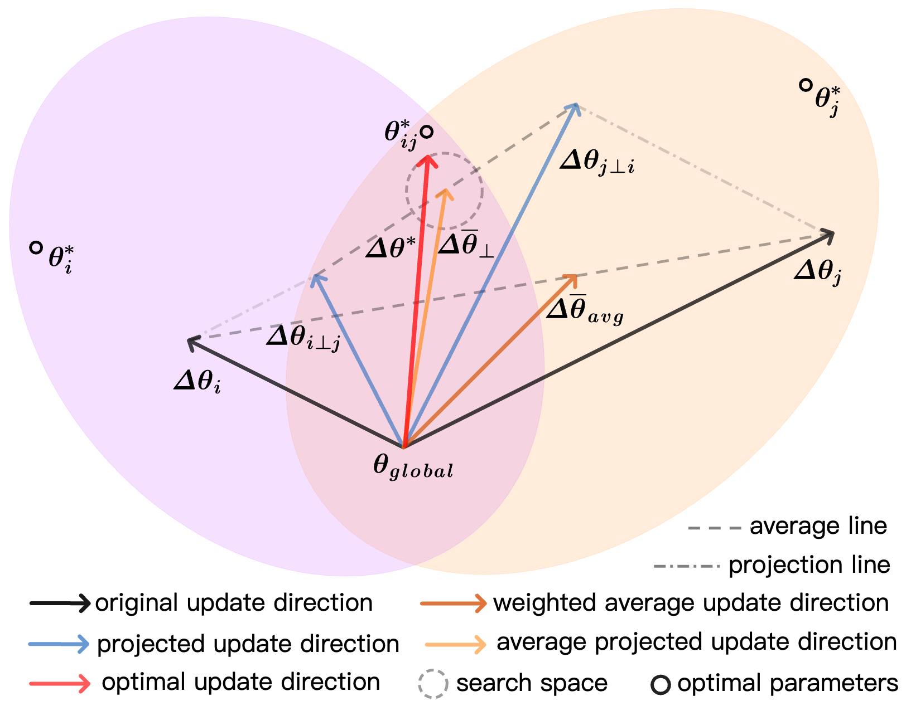

# ConFREE: Conflict-free Client Update Aggregation for Personalized Federated Learning

This is the implementation of our paper: ConFREE: Conflict-free Client Update Aggregation for Personalized Federated Learning (AAAI 2025 Oral). ConFREE is the first method to address client update conflicts in PFL. By optimizing global model aggregation, it provides each client with more effective and comprehensive global information.


- [Poster](./ConFREE_Poster.pdf)
- [Slides](./Hao%20Zheng_ConFREE_AAAI2025_Oral.pdf)

## Abstract
Negative transfer (NF) is a critical challenge in personalized federated learning (pFL). Existing methods primarily focus on adapting local data distribution on the client side, which can only resist NF, rather than avoid NF itself. To tackle NF at its root, we investigate its mechanism through the lens of the global model, and argue that it is caused by update conflicts among clients during server aggregation. In light of this, we propose a conflict-free client update aggregation strategy (ConFREE), which enables us to avoid NF in pFL. Specifically, ConFREE guides the global update direction by constructing a conflict-free guidance vector through projection and utilizes the optimal local improvements of the worst-performing clients near the guidance vector to regularize server aggregation. This prevents the conflicting components of updates from transferring, achieving balanced updates across different clients. Notably, ConFREE is modelagnostic and can be straightforwardly adopted as a complement to enhance various existing NF-resistance methods implemented on the client side. Extensive experiments demonstrate substantial improvements to existing pFL algorithms by leveraging ConFREE.

## 📝 Citation

If you find ConFREE useful for your research, please consider citing our paper:

```


```

## 📦 Algorithms
ConFREE projects conflicting updates onto a normal plane, creates a conflict-free guiding vector. The optimal is then found within a ball centered around conflict-free guiding vector, which maximizes the local improvement of the worst performing client in the neighborhood. This ensures the updated global model is closer to the global optimum and balances the update across clients.


## 📄 README
This README provides guidance on how to set up, run, and extend the code associated with our method, which is designed to be integrated within the PFLlib framework. Our approach is orthogonal to the existing methods in PFLlib, making it possible to combine them for complementary performance gains. The execution environment and dependencies are identical to those of PFLlib to ensure seamless integration.
https://github.com/TsingZ0/PFLlib
